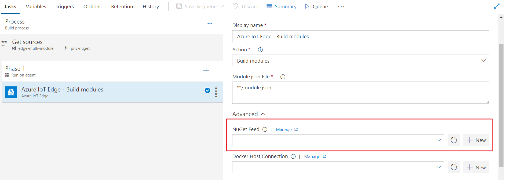
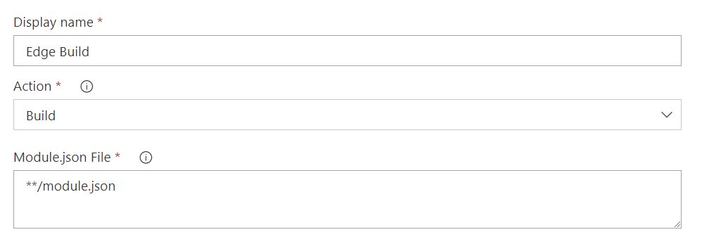
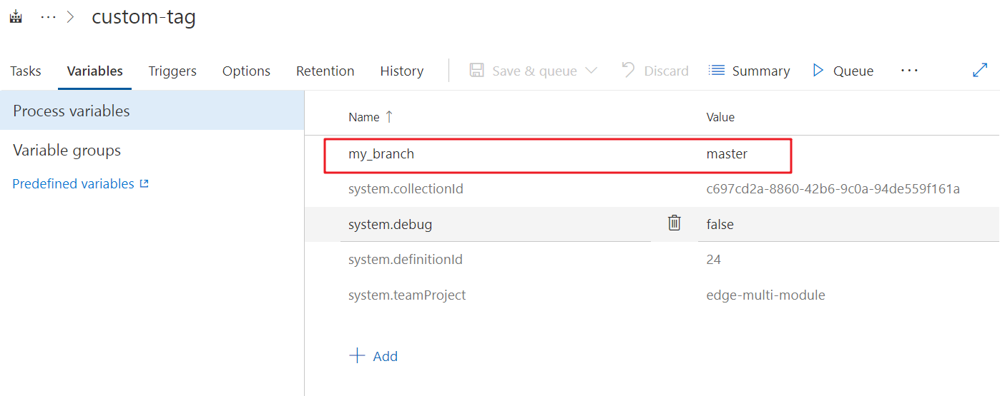
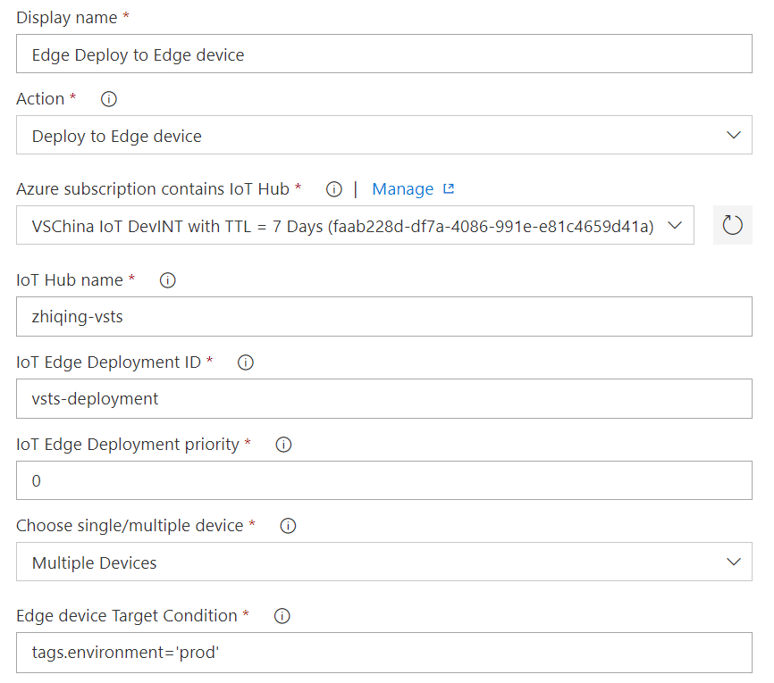

# Azure IoT Edge For VSTS
IoT Edge Build and Deploy is a tool for continuous integration(build and push docker image) and continuous deployment(create Edge deployment on Azure) for Azure IoT Edge modules project.

## Requirement
* The host agent should be Hosted Linux Preview.(Windows-based agents have some problem with docker)
* Your project should be a solution containing one or more Edge modules(C# or Function module)
* A deployment.template.json is under the root folder in the solution

## Usage
The extension installs the following tasks:

Each task has a field `Action`, different Action will provide different function for the task.

* Build  
Build task will build docker images for modules.  
  
In Build task, you need to specify which modules to build. Use `**/module.json` will match all the modules in the solution with module.json config file. Or you can specify the paths to the module.json, each take one line. [Wildcard is available](https://docs.microsoft.com/en-us/vsts/build-release/tasks/file-matching-patterns?view=vsts)

* Build and Push  
Build and push task will build docker images for modules and push to the docker registry.  
  
In Build and push task, you need to specify the docker registry. The Container Registry Type can be `Container Registry` (For docker hub or other docker registry) or `Azure Container Registry` (For Azure container registry service).

* Deploy to Edge device  
Deploy task will create a [deployment job](https://docs.microsoft.com/en-us/azure/iot-edge/how-to-deploy-monitor) on Azure IoT Hub.
  
In deploy task, you need to choose the Azure Subscription that contains your IoT Hub, and then input the IoT Hub name, deployment ID, deployment priority. There're 2 ways to deploy the Edge devices: `Single Device` or `Multiple Devices`. For single device, you need to specify the device ID. For multiple devices, input the target condition of devices you would like to deploy. Do not use double quote. Example: tags.building=9 and tags.environment='test'.

## Contact Information
For further information or to resolve issues, contact vsciot@microsoft.com.
